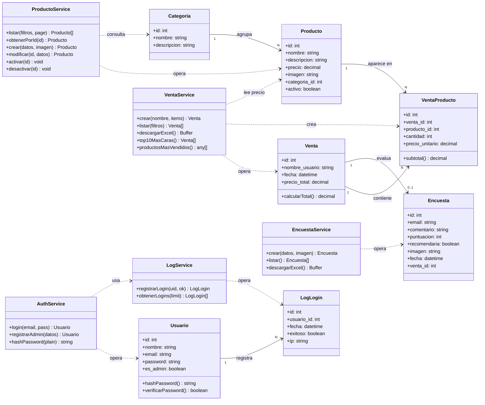
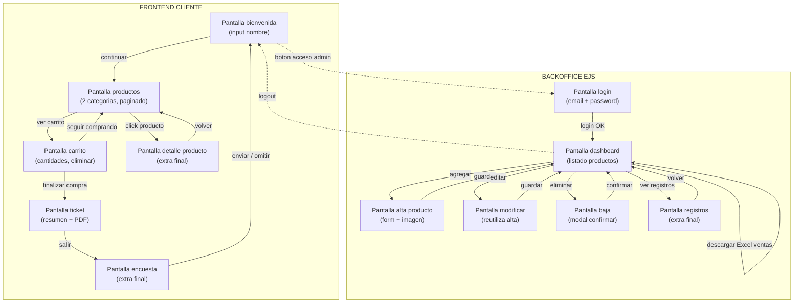

# Diagramas Mermaid - TP Integrador Programación III

Lavadero de autos - Autoservicio

---

## Diagrama 1: Modelo de clases (entidades + servicios)



---

## Diagrama 2: Flujo de pantallas (navegación)



---

## Diagrama 3: Endpoints API + vistas EJS

```mermaid
flowchart LR
  subgraph front["FRONTEND CLIENTE"]
    F1[Productos]
    F2[Carrito]
    F3[Ticket]
    F4[Encuesta]
  end

  subgraph api["API REST (JSON)"]
    direction TB
    E1["GET /api/productos<br/>?categoria=&page="]
    E2["GET /api/productos/:id"]
    E3["POST /api/productos<br/>(multer + imagen)"]
    E4["PUT /api/productos/:id"]
    E5["PATCH /api/productos/:id/activar"]
    E6["PATCH /api/productos/:id/desactivar"]
    E7["GET /api/categorias"]
    E8["POST /api/ventas"]
    E9["GET /api/ventas"]
    E10["POST /api/encuestas"]
    E11["POST /api/auth/login"]
    E12["POST /api/auth/registro-admin"]
  end

  subgraph ejs["VISTAS EJS (backoffice)"]
    V1["GET /admin/login"]
    V2["POST /admin/login"]
    V3["GET /admin/dashboard"]
    V4["GET /admin/productos/alta"]
    V5["GET /admin/productos/:id/editar"]
    V6["GET /admin/registros"]
    V7["GET /admin/ventas/excel"]
    V8["GET /admin/encuestas/excel"]
  end

  subgraph db[(BASE DE DATOS MySQL)]
    direction TB
    T1[productos]
    T2[categorias]
    T3[ventas]
    T4[ventas_productos]
    T5[usuarios]
    T6[encuestas]
    T7[logs_login]
  end

  F1 --> E1
  F1 --> E7
  F1 --> E2
  F2 --> E1
  F3 --> E8
  F4 --> E10

  E1 --> T1
  E2 --> T1
  E3 --> T1
  E4 --> T1
  E5 --> T1
  E6 --> T1
  E7 --> T2
  E8 --> T3
  E8 --> T4
  E9 --> T3
  E9 --> T4
  E10 --> T6
  E11 --> T5
  E11 --> T7
  E12 --> T5

  V2 --> E11
  V3 --> E1
  V4 --> E3
  V5 --> E2
  V5 --> E4
  V6 --> T7
  V6 --> T3
  V7 --> T3
  V8 --> T6
```

---

## Notas para importar en Figma

**Opcion 1: FigJam (recomendado)**
1. Abrir un FigJam board
2. Instalar plugin "Mermaid Chart"
3. Plugin > Mermaid Chart > pegar cada bloque

**Opcion 2: Figma Design**
1. Ir a https://mermaid.live
2. Pegar el codigo de cada diagrama
3. Actions > Download SVG
4. Arrastrar los SVG a Figma (quedan como vectores editables)

**Opcion 3: Si queres editarlos tipo whiteboard**
- Excalidraw (https://excalidraw.com) tambien acepta Mermaid (Library > Mermaid to Excalidraw)
- Permite exportar a Figma con plugin

---

## Convenciones usadas

- Relaciones "1 a N": flecha solida con cardinalidad
- Dependencias de uso (servicio usa entidad): flecha punteada `..>`
- Navegacion entre pantallas: flecha solida `-->`
- Navegacion opcional / cruzada (cliente <-> admin): flecha punteada `-.->`
